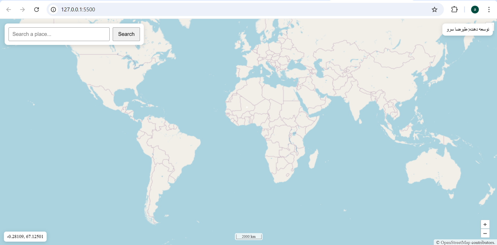
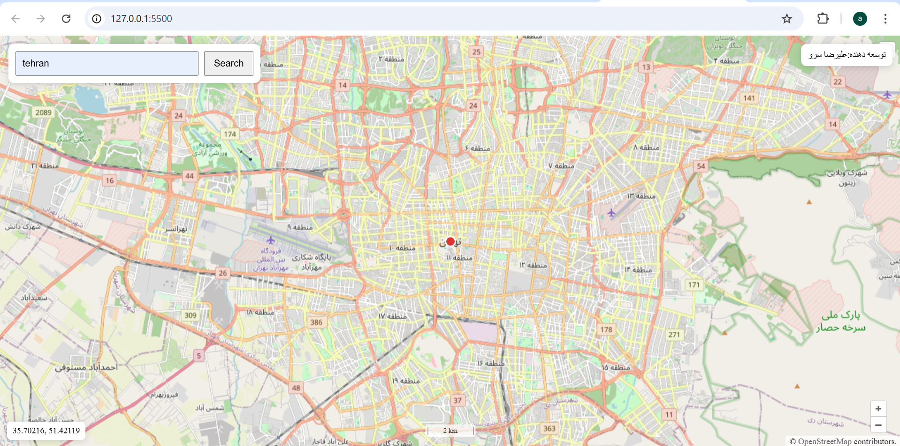
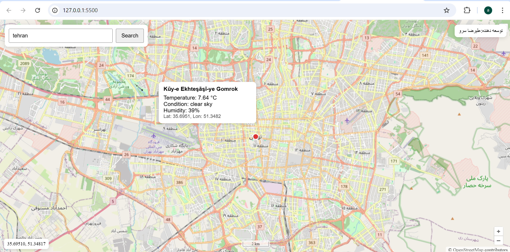

Interactive Web Map with OpenLayers
Overview

This project is a simple interactive web mapping application developed using OpenLayers and plain JavaScript.
The main purpose of the project is to practice working with web maps, asynchronous API calls, and external data services.

The application allows users to:

Search for a location by name and automatically zoom to it on the map

Click anywhere on the map to view current weather information for that location

This project was created as part of a web mapping assignment and focuses on clarity, simplicity, and correct use of APIs.

Main Features

OpenStreetMap base layer using OpenLayers

Location search with geocoding and smooth zoom animation

Marker display for searched locations

Weather information popup on map click

Scale line displayed at the bottom center of the map

Clean and minimal user interface built with HTML and CSS

Technologies Used

HTML, CSS, JavaScript (Vanilla)

OpenLayers library

JavaScript Fetch API

External APIs:

Geoapify (Geocoding)

OpenWeatherMap (Weather data)

Project Structure
openlayers-assignment/
│
├── index.html        # Main HTML file
├── style.css         # Styles and layout
├── script.js         # Map logic and API requests
├── README.md         # Project documentation
└── INSTRUCTIONS.md   # Original assignment description

How to Run the Project
Using VS Code (Recommended)

Open the project folder in Visual Studio Code

Install the Live Server extension

Right-click on index.html and choose Open with Live Server

The project will open automatically in your browser.

Alternative Method

You can also run a simple local server, for example:

python -m http.server 5500

Then open:

http://localhost:5500

API Keys and Security

This project uses API keys to access external services.

For security reasons:
### API Keys setup
1) Copy `api-keys.example.js` → `api-keys.js`  
2) Put your real API keys inside `api-keys.js`  
3) `api-keys.js` is ignored by git and will not be committed.

OpenLayers Usage
Map and Layers

An OpenStreetMap tile layer is used as the base map

A vector layer is used to display the search marker

View and Animation

The map view is initialized with a default center and zoom level

Smooth animations are used when zooming to search results

Controls and Interaction

Default zoom controls

Scale line control placed at the bottom center

Click events to retrieve coordinates and display weather data

Overlay

A popup overlay is used to show weather information at the clicked location

Geocoding API Comparison
APIs Reviewed

Geoapify

MapQuest

Google Maps Geocoding API

Pricing Overview (Approximate)
API	Free Usage	Cost per 1000 Requests
Geoapify	3,000 requests/day	~$0.20
MapQuest	15,000 requests	~$4.50
Google Maps	Credit-based	~$5.00
Price Comparison

Google Maps is about 25 times more expensive than Geoapify

MapQuest is about 23 times more expensive than Geoapify

Selected Geocoding API: Geoapify

Geoapify was chosen because it provides clear pricing, a useful free tier, and GeoJSON output that works well with OpenLayers. It is well suited for educational projects and small applications.

Weather API Comparison
APIs Reviewed

OpenWeatherMap

WeatherAPI.com

Visual Crossing

Pricing Overview (Approximate)
API	Free Usage	Cost per 1000 Calls
OpenWeatherMap	~1,000 calls/day	~$1.50
WeatherAPI.com	Free plan available	~$0.002
Visual Crossing	1,000 records/day	~$0.10
Price Comparison

OpenWeatherMap is significantly more expensive than WeatherAPI.com

WeatherAPI.com is the most cost-effective option for large-scale usage

Selected Weather API: OpenWeatherMap

OpenWeatherMap was selected because it is widely used, easy to understand, and well documented. It is a good choice for demonstration and academic purposes.

Screenshots

Screenshots of the application can be added to a screenshots folder, including:

Initial map view with search bar

Zoomed search result with marker

Weather popup displayed after clicking on the map

Example Commit Messages
feat: initialize OpenLayers map with OSM base layer
feat: add geocoding search functionality
feat: display weather data on map click
style: improve map UI and control layout
docs: add project documentation and API comparison

---

## Screenshots

### Map and Search Interface

### Geocoding Result

### Weather Information Popup

